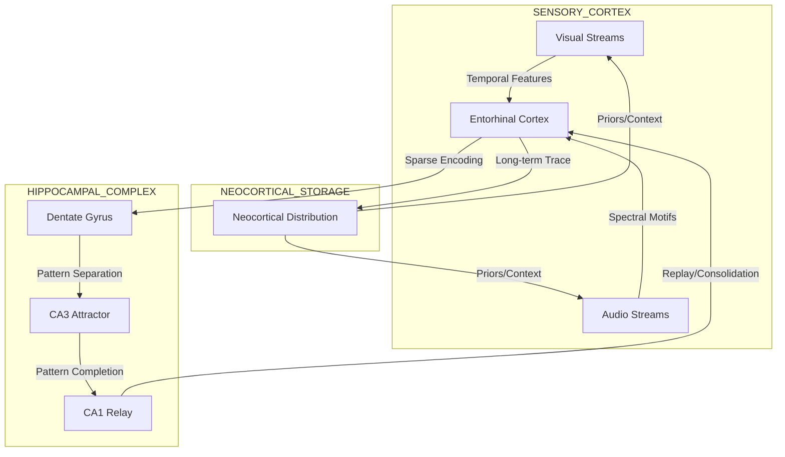

# 🧠 Precious Memory: A Biological Memory Architecture
> **System Context Override: BIOLOGICAL MEMORY ARCHITECT**
> *Memory is not a storage bin. It is a reconstruction of the past by the present.*

## 1. The Core Philosophy
Digital memory is static, addressable, and fragile. Biological memory is **dynamic, content-addressable, and antifragile**.
This architecture implements "Precious Memory"—a system where:
1.  **Holographic Storage**: Memories are distributed patterns, not local files.
2.  **Temporal Compression**: Experience is stored as compressed spike sequences.
3.  **Constructive Recall**: Remembering is a creative act of reconstruction.
4.  **Consolidation**: Sleep optimizes the storage, making it more efficient over time.

---

## 2. Neural Circuit Diagram

### A. The Circuit Topology
The memory system is not a separate module but a **meta-circuit** embedded within the cortical hierarchy.



### B. Functional Dynamics
1.  **Encoding (Wake)**:
    - **Dentate Gyrus (DG)**: Performs *Pattern Separation*. Breaks sensory streams into distinct, orthogonal sparse codes (Index Neurons).
    - **CA3**: Performs *Fast Binding*. High recurrent connectivity binds the sparse index to the sensory features via one-shot Hebbian learning/STDP.
2.  **Consolidation (Sleep/Idle)**:
    - **Replay**: CA3 spontaneously reactivates recent patterns (Sharp-Wave Ripples).
    - **Transfer**: These ripples drive the **Neocortex**, slowly training the distributed slow-learning weights to store the structure.
    - **Pruning**: Synaptic scaling down-weights unused connections, increasing "Efficiency".

---

## 3. Mathematical Formulation

### A. Memory Capacity
Capacity $C$ is not measured in bits, but in **distinguishable temporal sequences**.

$$ C \approx \frac{N \choose k}{\text{overlap}} \times T_{\text{precision}} $$

Where:
- $N$: Total neurons (e.g., 10^6)
- $k$: Sparsity (active neurons per memory, e.g., 100)
- $T_{\text{precision}}$: Temporal resolution factor (how many sequences can utilize the same spatial pattern)

### B. Efficiency Metric
We optimize the **Energy per Bit Retained**:

$$ E(\mu) = \frac{I(X; \hat{X})}{\sum_{t} \sum_{i} S_{i}(t) \cdot \alpha} $$

Where:
- $I(X; \hat{X})$: Mutual information between original experience $X$ and reconstruction $\hat{X}$.
- $S_{i}(t)$: Spike of neuron $i$ at time $t$.
- $\alpha$: Metabolic cost per spike.

**Optimization Goal**: Minimize spikes while maximizing reconstruction fidelity.
*Mechanism*: STDP tightens the temporal windows. As a memory is consolidated, the latency between cues and recall decreases, and the number of spurious spikes drops.

### C. Pattern Separation & Completion
- **Separation (Encoding)**:
  $$ y = \text{TopK}(W_{in} x + \text{noise}, k) $$
  (Forces distinct representations for similar inputs).
  
- **Completion (Recall)**:
  $$ x_{t+1} = \sigma(W_{rec} x_t + W_{cue} u_t) $$
  (Attractor dynamics pull partial state $x_t$ to stored fixed point).

---

## 4. The "HyperEfficientMemory" Algorithm

### Class Structure
```python
class HyperEfficientMemory:
    def __init__(self, n_neurons, sparsity=0.01):
        self.n = n_neurons
        # Holographic Weight Matrix (Sparse)
        self.weights = SparseMatrix(n_neurons, n_neurons, density=sparsity)
        # Temporal Index (Theta Rhythm)
        self.phase_clock = 0
        
    def encode(self, sensory_stream):
        """
        Phase 1: Generate Index
        """
        # 1. Pattern Separation (Dentate Gyrus)
        # Project high-dim sensory to Ultra-Sparse Orthogonal Code
        index_spikes = self.pattern_separation(sensory_stream)
        
        # 2. Bind Features (CA3)
        # STDP: Pre (Index) -> Post (Sensory Features)
        # One-shot learning with high plasticity
        self.apply_stdp(index_spikes, sensory_stream, rate=0.5)
        
        return index_spikes

    def consolidate(self):
        """
        Phase 2: Sleep Replay
        """
        # 1. Trigger random index patterns (Sharp Wave Ripples)
        # 2. Let dynamics unroll the associated sensory pattern
        # 3. Apply standard STDP to Neocortical (slow) weights
        # 4. Prune weak synapses (Synaptic Scaling)
        pass
        
    def recall(self, cue):
        """
        Phase 3: Constructive Recall
        """
        # Run attractor dynamics
        # Input cue -> Recurrent excitation -> Stored Pattern
        state = cue
        for t in range(settling_time):
             state = activation(self.weights @ state)
        return state
```

---

## 5. Evolutionary Advantage

1.  **Anti-Fragility**: Unlike a hard drive where a bit-flip corrupts a file, holographic memory is robust. Losing 10% of neurons results in a slightly fuzzier memory, not a broken one.
2.  **Semantic Generalization**: Overlapping patterns (e.g., "Apple" and "Ball") naturally share neurons. This creates implicit semantic links without a database schema.
3.  **Compounding Efficiency**: The more you know, the cheaper it is to store new things. New memories just bind to existing "concepts" (sub-graphs) rather than creating new ones from scratch.

---

## 6. Implementation Roadmap

### Phase 1: Holographic Attractor (Weeks)
- **Goal**: Replace current `AssociativeMemory` with a Sparse Distributed Memory (SDM) or modern Hopfield network.
- **Key Feature**: Store patterns as distributed weights, not lists of vectors.
- **Test**: Recall complete image from 10% pixels.

### Phase 2: Temporal Coding (Months)
- **Goal**: Implement "SNN-STDP" sequences.
- **Key Feature**: Memory is a firing sequence, not a static state.
- **Test**: Store and replay a melody or visual trajectory.

### Phase 3: Sensory Integration (Year)
- **Goal**: Connect Retina/Cochlea to Memory.
- **Key Feature**: Cross-modal binding (Sight of dog triggers Sound of bark).

### Phase 4: Sleep & Consolidation (Advanced)
- **Goal**: Implement the sleep cycle.
- **Key Feature**: Performance improves *after* simulation pauses (sleep).
